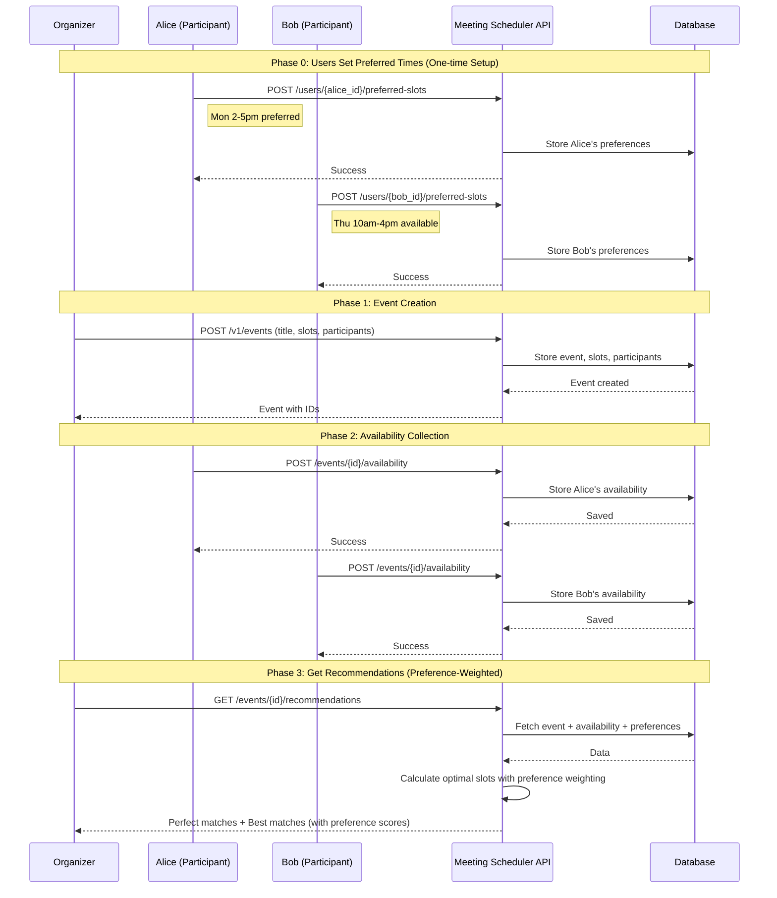

## Complete User Journey Flow

```mermaid
sequenceDiagram
    participant Org as Organizer
    participant Alice as Alice (Participant)
    participant Bob as Bob (Participant)
    participant API as Meeting Scheduler API
    participant DB as Database

    Note over Org,DB: Phase 0: Users Set Preferred Times (One-time Setup)
    Alice->>API: POST /users/{alice_id}/preferred-slots
    Note right of Alice: Mon 2-5pm preferred
    API->>DB: Store Alice's preferences
    API-->>Alice: Success

    Bob->>API: POST /users/{bob_id}/preferred-slots
    Note right of Bob: Thu 10am-4pm available
    API->>DB: Store Bob's preferences
    API-->>Bob: Success

    Note over Org,DB: Phase 1: Event Creation
    Org->>API: POST /v1/events (title, slots, participants)
    API->>DB: Store event, slots, participants
    DB-->>API: Event created
    API-->>Org: Event with IDs

    Note over Org,DB: Phase 2: Availability Collection
    Alice->>API: POST /events/{id}/availability
    API->>DB: Store Alice's availability
    DB-->>API: Saved
    API-->>Alice: Success

    Bob->>API: POST /events/{id}/availability
    API->>DB: Store Bob's availability
    DB-->>API: Saved
    API-->>Bob: Success

    Note over Org,DB: Phase 3: Get Recommendations (Preference-Weighted)
    Org->>API: GET /events/{id}/recommendations
    API->>DB: Fetch event + availability + preferences
    DB-->>API: Data
    API->>API: Calculate optimal slots with preference weighting
    API-->>Org: Perfect matches + Best matches (with preference scores)
```

